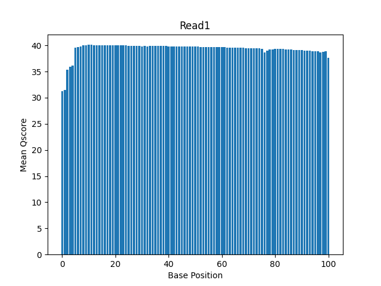
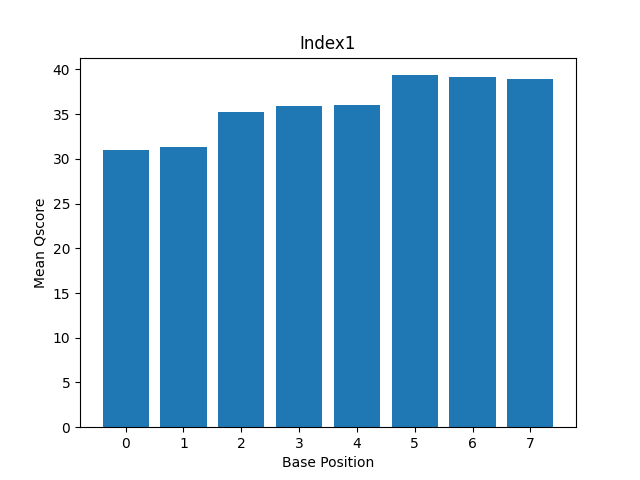
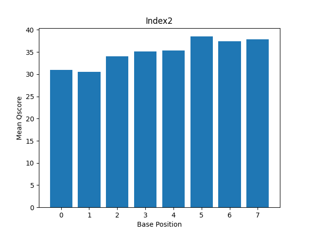
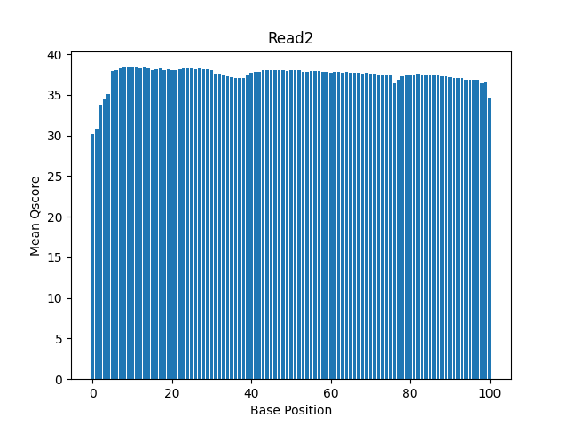

# Assignment the First

## Part 1
1. Be sure to upload your Python script.

| File name | label | Read length | Phred encoding |
|---|---|---|---|
| 1294_S1_L008_R1_001.fastq.gz | read1 | 101 | phred33 |
| 1294_S1_L008_R2_001.fastq.gz | index1 | 8 | phred33 |
| 1294_S1_L008_R3_001.fastq.gz | index2 | 8 | phred33 |
| 1294_S1_L008_R4_001.fastq.gz | read2s | 101 | phred33 |

2. Per-base NT distribution
    1. Use markdown to insert your 4 histograms here.
        
        
        
        
    2. For the indexes, I chose to have a quality cutoff of Q30 for both index reads and biological read pairs. I chose Q30 because in the histograms from part 1, the mean Qscores tended to be around Q30 or above. Also, when I was reading about Illumina it says that they use a Q30 cutoff, so that validated that Q30 could potentially be a good cutoff value. For the index reads, I set the requirement that each base position needed to have a quality score >= Q30 because I wanted to make sure that I had good quality indexes. However, for the biological read pairs, I set the requirement so that the mean Qscore of the sequence >= Q30 because it is okay if there are N's located in the biological read.
    3. In Index 1 file, 3976613 indexes contain an N. In Index 2 file, 3328051 indexes contain an N. There is a total of 7304664 indexes with an N.
```
    zcat 1294_S1_L008_R2_001.fastq.gz | sed -n "2~4p" | grep -c "N" --> 3976613
    zcat 1294_S1_L008_R3_001.fastq.gz | sed -n "2~4p" | grep -c "N" --> 3328051 
```
    
## Part 2
1. Define the problem
    -writing an algorithm to de-multiplex files and report index-hopping
    -demultiplex reads by index-pair
    -Need to compare index 1 and index 2 for each read to see if they match or don't match
    -Separately the 4 reads into categorized files based on certain filtering conditions
2. Describe output
    outputting 52 total files:
    -one R1 FASTQ file per matching index-pair
    -one R2 FASTQ file per matching index-pair
    -two additional FASTQ files for non-matching index-pairs (index-hopping), 
    -two additional FASTQ files when one or both index reads are unknown or low quality 
        *unknown = does not match the 24 known indexes, index has a 'N', or does not meet a quality score cutoff.
3. Upload your [4 input FASTQ files](../TEST-input_FASTQ) and your [>=6 expected output FASTQ files](../TEST-output_FASTQ).
4. Pseudocode
```
    -Open all 4 files and read in parallel (will be looping through the records)
    -Read the sequence line of the nth record for all 4 files
    -Create set of 24 known indexes (forward/given)
    -Create 3 counters to keep track of number of reads going into each file: matched, unmatched, unknown
    -Collect all 4 lines of the record into 4 temporary arrays of size 4 (will save each line as a position in the array)
    -For each record:
        -if any base pair position has Qscore < 30 for either index --> unknown file, increment unknown counter
        -Check if any N's in the index 1 or index 2. If either containts an N --> unknown file, increment unknown counter
        -Check if index 1 in set:
            -if index 1 is not in the set --> unknown file, increment unknown counter
            -if index 1 in set --> continue filtering
                -Check if rev comp Index 2 is in set:
                    -If rec comp Index 2 not in set --> unknown file, increment unknown counter
                    -If rev comp Index 2 is in set --> check if matching
                        -Check if matching: does index 1 == rev comp index 2
                            -Yes --> index1_rcindex2_Read#.fq (matched files) (rcindex2 = reverse complement of Act2), , increment matched counter
                            -No --> unmatched file, increment unmatched counter  
```
5. High level functions. For each function, be sure to include:
    1. Description/doc string
        -Reverse complement function:
            ```Take in DNA sequence as input (5' - 3'). Return reverse complement of input sequence (5' - 3').```
    2. Function headers (name and parameters)
        def rev_comp(str: sequence) -> str
    3. Test examples for individual functions
```
        -Reverse complement function:
            rev_comp(AAGGTCTGA)
                * input: AAGGTCTGA --> return: TCAGACCTT
            rev_comp(TGATTTTGCAGGA)
                * input: TGATTTTGCAGGA --> return: TCCTGCAAAATCA
``` 
    4. Return statement
        -Reverse complement function: (revs_comp is a variable that I will be using in the function)
            return revs_comp